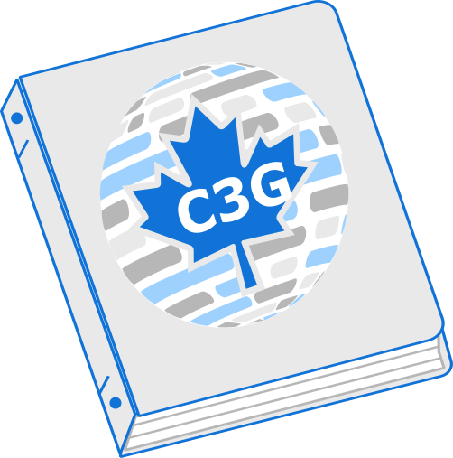

:::{.callout-warning title="Current status"}
The catalog is being developed and workshop pages will be added progressively. Please check back later for new content and updates.
:::

::: {.home-catalog-intro}
{.home-catalog-figure}

[The C3G Training Catalog brings together workshop repositories, partner workshops, and tutorial directories so trainees, researchers, and professionals can quickly find relevant material.]{.home-catalog-highlight}
:::

## Discover the Catalog

::: {.home-notes-board}
::: {.home-note .home-note-find}
#### Find Training Faster
Use searchable catalogs with topic filters to discover workshops and tutorials relevant to your project.
:::

::: {.home-note .home-note-track}
#### Track Fresh Content

See the latest update dates for tutorial directories and keep up with evolving learning material.
:::

::: {.home-note .home-note-contribute}
#### Contribute Clearly

Follow practical contribution guidelines to publish new workshop and tutorial resources in the catalog.
:::
:::

## Browse availible workshops and tutorials
::: {.home-start-rows}
::: {.home-note .home-start-row}
#### [Workshops](workshops.qmd){.home-start-link}

Searchable catalog of C3G and partner workshop repositories.
:::

::: {.home-note .home-start-row}
#### [Tutorials](tutorials.qmd){.home-start-link}

Tutorial directory catalog sourced from c3g/c3gW-Tutorials.
:::

::: {.home-note .home-start-row}
#### [Contribute](contribute.qmd){.home-start-link}

Naming, metadata, and update workflow for contributors.
:::
:::

::: {.home-status}
<!-- Catalog data is generated from GitHub metadata and refreshed with `python3 scripts/fetch_workshops_data.py`. -->
:::

::: {.home-newsletter-cta}
## Stay Connected

Join the C3G mailing list to stay informed about new training opportunities, workshops, tutorials, and events in bioinformatics, life sciences, and computational genomics.

<a class="home-newsletter-button" href="https://computationalgenomics.ca/community/newsletter/" target="_blank" rel="noopener noreferrer" aria-label="Subscribe to our newsletter">Subscribe to our newsletter</a>
:::

::: {.content-visible}

:::
